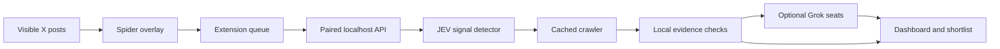

<p align="center"></p>

## Windows token monitor

This standalone desktop project builds on [h100envy/gem-search](https://github.com/h100envy/gem-search). Original history and MIT licensing are preserved. The earlier fork and historical downloads remain available at [gem-search](https://github.com/nightangelflowerwin-ops/gem-search).

The Windows app includes a read-only MCP connection for compatible assistants. Anyone can connect their own local app using Assistant connection in the sidebar. See [MCP setup and tools](docs/MCP.md).

The desktop app provides a workspace for tokens, watchlists, saved records and notification controls. Start monitoring manually, then stop it manually or choose a time limit. Download the Windows preview from [Releases](https://github.com/nightangelflowerwin-ops/GemSearch/releases). See [desktop usage](docs/DESKTOP.md) for setup and limitations.

<p align="center">
  <a href="https://github.com/nightangelflowerwin-ops/GemSearch/actions/workflows/ci.yml"></a>
  
  
  
  <a href="LICENSE"></a>
</p>

<h1 align="center">🕷️ Meet the curious side of your feed.</h1>
<p align="center"><b>Your next research rabbit hole has eight legs.</b><br>A browser companion that turns the posts you see into questions worth asking.</p>
<p align="center"><a href="#-whats-new-the-spider-catches-it-early">What's new</a> · <a href="#quick-start">Get started</a> · <a href="docs/README.ru.md">Русский</a> · <a href="docs/ARCHITECTURE.md">Architecture</a> · <a href="docs/PRIVACY.md">Privacy</a></p>

<br>

<table>
<tr>
<td width="33%" valign="top"><h3>🌈 A companion, with character</h3>A spider walks through your feed, pauses on a post and shows what it is investigating. You can see the work happening.</td>
<td width="33%" valign="top"><h3>🔎 Every lead has a trail</h3>Posts, public links, checks and unknowns stay attached to the finding. Open the source. Challenge the conclusion.</td>
<td width="33%" valign="top"><h3>🏡 Your computer is home</h3>The engine and database run locally. Add your own Grok key when you want model reviews. No hosted Gem Search account.</td>
</tr>
</table>

<br>

## ✨ What's new: the spider catches it early

<p align="center"></p>

<!-- 🎬 Screen recording: drag the .mp4 into GitHub's README editor and keep the generated link on its own line here. -->

A narrative is most interesting **before it has a name**. Until now the spider sorted everything into five fixed topics. Now it also notices the small, specific things that show up first, and tells you how fast they are moving.

<table>
<tr>
<td width="50%" valign="top"><h3>💲 Tickers</h3>Every <code>$CASHTAG</code> in your captures becomes its own lead, with its own authors and posts. <code>$BTC</code>, <code>$SOL</code>, <code>$USDC</code>, other majors and prices like <code>$100</code> are skipped. One click opens a live X search.</td>
<td width="50%" valign="top"><h3>🧾 Contracts</h3>Solana addresses are kept only when they decode to a real 32-byte key, so long random words never sneak in. One click opens the address on Solscan.</td>
</tr>
<tr>
<td width="50%" valign="top"><h3>🌱 New narratives</h3>Two-word phrases that <b>three or more different authors</b> repeated in the last 6 hours, outside every known topic. Overlapping wording from one sentence counts once.</td>
<td width="50%" valign="top"><h3>📈 Growth</h3>Each lead shows mentions in the last 6h against the pace of the 18h before, authors in the last 6h, and when the spider first saw it. Quiet for a day, then everyone at once: that is the ×9.</td>
</tr>
</table>

**In Discovery:** filter by signal type, sort by **Fastest growing**, **Newest first** or **Most authors**, and open the velocity panel on any lead.

### Try it in one minute

```sh
python3 app.py                       # terminal 1: the local engine
python3 scripts/SpiderDemo.py       # terminal 2: stream fictional sample posts with live logs
```

The walkthrough sends each post through the extension API and prints what the real engine reports back: captures, engine events, every lead with its growth and four checks. Use `scripts/SampleSignals.py` instead for a silent load, or `--speed 2` for a faster run.

1. Open **http://127.0.0.1:8787**, wait ~10 seconds for the spider loop.
2. In **Discovery**, switch **All types** to **Tickers $**, then **New narratives**.
3. Set the sort to **Fastest growing**: `$WEBZ` and “rainbow spiders” jump to the top at ×9.
4. Open a lead to see the **Signal velocity** panel, the posts behind it and the Solscan / X search link.

The sample posts, handles, `$WEBZ` and the address are invented and marked `(sample)`. On a real feed the same leads appear from what the spider sees in your tabs.

### Bring your own topics

Copy `topics.example.json` to `topics.json`, edit the patterns (up to 40 topics, case-insensitive regular expressions) and restart. A broken file is ignored with a warning and the built-in topics stay active. `topics.json` stays on your machine.

### Same rules as before

- **Research-only.** Tickers, addresses and phrases never enter the launch queue, even with `SPIDER_ALLOW_LAUNCH=1`. They belong to other people.
- **Local.** Detection runs inside the engine on your computer. No new API calls, no new keys.
- **Bounded.** Up to 10 tickers, 10 addresses and 5 phrases per pass, strongest first, so the Grok allowance goes to the best leads.
- **Honest.** Growth describes your browsing sample, not all of X. Three coordinated accounts can fake a phrase; a cashtag is a lead, not a verified token.

## Meet your narrative spider

Gem Search puts an animated eight-legged research companion on your X feed. It walks between visible posts, highlights what it is inspecting, and sends a small capture to a research engine running on your computer.

**JEV** groups recurring topics and project links. **Crawler** reads public sites, repositories and docs. **Four Grok seats** challenge the evidence from different perspectives. Your dashboard keeps the sources, gaps and decisions together.

The spider is a browser overlay, not an operating-system desktop pet. It cannot walk outside the page or monitor another application. It doesn't like, reply, follow accounts or connect a wallet.

This is an open-source developer preview, not a promise of early alpha. A shortlist is a research lead, not proof of safety, originality or future returns.

<p align="center"></p>

## What it does

| Layer | Behavior |
| --- | --- |
| 🕷 Spider | Animated overlay, current-post highlight, capture counters, pause/dismiss, optional visible-tab auto-scroll |
| JEV | Local post deduplication, topic grouping, cashtags, Solana addresses, emerging phrases, 6h growth, author diversity and repeated-text checks; editable English/Russian topics |
| Crawler | Follows bounded public HTTP(S) links; caches pages for 30 minutes; blocks private-network targets |
| Grok seats | Four actual API requests with role-specific prompts, structured output and evidence references; optional |
| Dashboard | Filterable projects/narratives, local checks, Grok reasons, sources, persistent activity log and JSON export |
| Local queue | Survives extension worker suspension and backend restarts; bounded to avoid unlimited collection |
| Economy mode | No paid X API required to inspect the posts already visible in your browser; local rules work without Grok |

**JEV is our own signal detector**, not an integration with an unnamed external JEV product. Grok uses the official xAI API; this repository is not an official X/xAI extension. Reading the current DOM is not an X firehose or a substitute for a licensed data service.

## ✦ Turn a finding into a keepsake

Open a project in **Discovery**, click **Discovery capsule**, choose **Aurora** or **Daylight**, and download a standalone SVG card. It captures mentions, observed authors, local check results, Grok status, up to three source addresses and a UTC timestamp. A rainbow spider signs the design.

- Preview before downloading; the selected finding is frozen while the card is open.
- Generated entirely in your browser, without an API call or automatic posting.
- Demo findings remain visibly marked. Missing evidence stays missing.
- Source addresses omit credentials, query strings and fragments; review the visible content before sharing.

## Pick your first adventure

<p align="center"></p>

- **🎨 Just look around:** launch the backend and open `/spider-demo` to meet the spider on fictional posts.
- **🕷️ Explore your feed:** pair the extension, open X and release the spider on the active tab.
- **🧠 Ask more questions:** add your own xAI key to enable the four Grok reviewers.
- **📂 Bring existing research:** import JSON captures using the documented [data format](docs/DataFormat.md).
- **🌱 Broaden the inputs:** run `python3 app.py --autopilot` for the Hacker News scanner and inbox watcher.

## Quick start

Python **3.11+**, Chrome/Chromium. Backend: macOS, Linux, or Windows through WSL2. Node **22+** is needed only for the full test suite and optional Solana module; the research backend and extension need no npm build.

```sh
git clone https://github.com/h100envy/gem-search.git
cd gem-search
cp .env.example .env
python3 app.py
```

1. Open **http://127.0.0.1:8787**. Visit **Connections** and copy the local pairing code.
2. Open **chrome://extensions**, enable **Developer mode**, click **Load unpacked**, select this repository's **extension/** directory.
3. Open the Gem Search toolbar popup, paste the pairing code and click **Connect**.
4. Open an X feed, search or profile page. Choose **Until I stop it** (the default) or a time limit, then click **Release spider on this tab**.
5. Scroll normally, or opt into auto-scroll, including in the background. The spider samples rendered posts in the selected feed's viewport even when you switch tabs or apps. Editing on the visible page pauses auto-scroll, not the scanner. **Stop scanner** in the popup works from any tab; overlay Stop or dismiss also ends the session.

The local engine must stay running. If it is offline, up to 200 captured posts remain in the extension queue. The next successful connection forwards them. Worker suspension and same-origin feed reloads retain the scanner's original session/deadline. A one-minute worker alarm supplements content timers in background tabs. Captures after the deadline are rejected even if an alarm is delayed.

Keep the browser and selected feed tab open. Browsers can throttle background execution; sleeping computers and discarded/frozen pages cannot render new posts. The session waits for an unloaded tab to recover. Closing that tab, leaving supported feed routes/origin, or restarting the browser ends the session. Start a new session after reopening the browser. Stop prevents new collection; already queued posts may still be forwarded. This is best-effort background research, not an always-on data feed.

**Try the spider without an X account:** open **http://127.0.0.1:8787/spider-demo**. It uses the same spider renderer over fictional cards, makes no API calls and collects nothing. The dashboard's **Demo scan** separately exercises the research pipeline with clearly marked synthetic projects.

## Give it four Grok perspectives

<p align="center"></p>

Add your key **locally** to `.env`, then restart the engine:

```dotenv
GROK_ENABLED=1
XAI_API_KEY=your_local_api_key
GROK_MODEL=grok-4.7
GROK_DAILY_CALLS=12
```

| Seat | Question |
| --- | --- |
| **Lookout** | Is there a noteworthy signal in the observed sample? |
| **Maker** | What product or technical evidence is actually present? |
| **Skeptic** | What is contradictory, risky or still unverified? |
| **Runner** | Is there enough evidence to investigate this now? |

Reviews begin only after at least four distinct observed authors. One full review makes **four requests**, so the default limit permits at most **three full reviews per rolling 24 hours**, including failed calls. Results are cached for 24 hours for identical evidence/model inputs. Each request has bounded excerpts and a 700-token output limit. This is a request allowance, **not a guaranteed dollar cap**; your xAI plan determines charges. No xAI search tools are enabled.

Keys stay in the backend. Collected excerpts leave your computer **only when Grok is enabled**, sent to `api.x.ai` for analysis. Without a key, the UI shows local checks instead. An unavailable model, exhausted allowance, invalid response or invented citation cannot count as a pass. Model outputs cannot execute code, browse independently or control wallets.

The Grok adapter is implemented and covered by mocked tests. A real paid Grok call has **not** been validated in this checkout because no xAI key was provided.

## Follow a discovery

<p align="center"></p>

1. **Spot a recurring idea.** The spider captures rendered posts as you explore a visible X tab.
2. **Connect the mentions.** JEV groups supported topics and project links, deduplicates captures and checks author diversity.
3. **Read beyond the post.** The crawler retrieves bounded public pages to add context to the observed signal.
4. **Challenge the story.** Local checks run first; optional Grok seats return separate reasons tied to supplied evidence.
5. **Keep the trail.** Open the dashboard to review sources, inspect unknowns and export findings as JSON.

*These illustrations explain the workflow; they are not screenshots or measured results.*

## Your first research session

- [ ] Start the local engine and open the dashboard.
- [ ] Try the fictional spider demo before connecting a real feed.
- [ ] Pair the extension from **Connections**.
- [ ] Release the spider on an X feed, search or profile page.
- [ ] Watch the capture counter; pause whenever you want.
- [ ] Open a finding and read its linked sources.
- [ ] Compare the available checks and explicitly unverified claims.
- [ ] Export useful findings for your own follow-up research.

## Keep the running cost small

- **Begin without Grok.** Local grouping and checks do not require an xAI key.
- **Reuse crawled pages.** The crawler caches pages for 30 minutes.
- **Reuse model reviews.** Identical evidence/model inputs use a 24-hour review cache.
- **Bound the model workload.** The default allowance is 12 requests per rolling 24 hours; each full review uses four.
- **Choose when to collect.** Capture runs on the visible tab; auto-scroll is optional.

Your computer, internet connection and any enabled paid services still have their own costs. Request limits do not guarantee a fixed API bill.

## A transparent pipeline



A browser token can only submit captures and read scanner status. It cannot launch tokens. The extension has no account-action code and no xAI API key. See [architecture](docs/ARCHITECTURE.md) and [privacy](docs/PRIVACY.md).

## Connect your launch platform

- **Built-in:** Pump.fun via the existing local PumpPortal executor.
- **Bring your own:** connect a Solana platform through the new HTTPS launch-bridge protocol.
- **Keep one queue:** provider selection preserves the five-attempt daily quota and narrative deduplication.
- **Recover conservatively:** jobs pin their provider; uncertain submissions are polled without creating a replacement.
- **Build an adapter:** a Python HTTPS + SQLite scaffold is included. Map its two hooks to your platform API.

Select `LAUNCH_PROVIDER=pumpportal` or `bridge` in `.env`. An arbitrary platform website URL does not work: it needs a compatible adapter. External bridges manage their own signing and must enforce the requested 0.025 SOL cap; their results are reported, not independently verified by Gem Search. Other chains are not supported by the current SOL budget policy.

**[Connection guide and API contract →](docs/LaunchProviders.md)**

## Other sources and optional launch module

- JSON import and `data/inbox/` support external collectors. See [data format](docs/DataFormat.md).
- `python3 app.py --autopilot` also enables the free Hacker News narrative scanner and inbox watcher. HN attention is labeled separately from X captures.
- Official X recent-search access remains optional and paid; `ENABLE_PAID_X=0` by default.
- The earlier experimental Pump.fun launcher remains available as a **separate opt-in module**, dry-run by default. Browser captures cannot enter it without `SPIDER_ALLOW_LAUNCH=1`.
- Its configured ceilings are 0.025 SOL per attempt and five attempts per rolling 24 hours. It is not required to use the spider. See [launch module](docs/AUTOLAUNCH.md) and [setup](SETUP.md).

## Package, test, contribute

```sh
npm ci --ignore-scripts
python3 -m unittest discover -s tests -v
npm test
python3 scripts/PackageExtension.py
```

The ZIP is written to `dist/GemSearchExtension.zip`; it contains extension assets only. Extract it and load that directory as an unpacked extension. GitHub Actions also uploads the ZIP as a build artifact. This is **not** a Chrome Web Store listing.

Tests cover capture validation, route exclusions, deduplication, narratives, Grok caching/allowances/failures, local-network blocking, queue recovery, and optional transaction guards. They do not establish that every future X layout will work. Full browser installation and real-account capture still need manual QA against the current X markup. See [contributing](CONTRIBUTING.md).

## Project map

```text
extension/           Manifest V3 popup, worker, extractor and animated spider
jev.py               Local topics, tickers, addresses, emerging phrases, growth
topics.example.json  Template for your own local topic list
grok.py              Four optional API reviewers + persistent request allowance
app.py               Local HTTP engine, crawler, dashboard and capture worker
static/              Research dashboard
docs/                Architecture, privacy, preview and launch documentation
scripts/             Icon generation, ZIP packaging, sample signals and terminal walkthrough
automation.py        Optional durable launch queue
launch/              Optional isolated-wallet Solana executor
tests/               Offline tests and unsigned provider fixture
```

## Limits worth understanding

X markup changes. The extractor uses rendered `article[data-testid="tweet"]`, text, timestamp permalinks and visible external anchors. Shortened `t.co` links aren't treated as verified project sites. Topic discovery uses a small, inspectable taxonomy that you can replace with `topics.json`. Emerging-phrase detection catches repeated wording, not meaning: it can miss memes spelled differently, sarcasm and novel projects, and three coordinated accounts can fake a phrase. A cashtag or address is a lead, not a verified token. A linked repository isn't proof of a functioning product. No model here detects every scam or bot ring.

The engine is local and single-user. Do not expose its port to the internet. Keys, wallet files, captured posts and SQLite are ignored by Git. Read [SECURITY.md](SECURITY.md) before changing trust boundaries.

MIT · Independent project. Not affiliated with X, xAI, Pump.fun or PumpPortal.

<br>
<p align="center">🌸 🟠 🌼 🌿 🧊 🔮</p>
<p align="center"><b>Keep the curiosity. Keep the receipts.</b><br><sub>If this little spider belongs in your feed, give it a star and help it grow.</sub></p>
