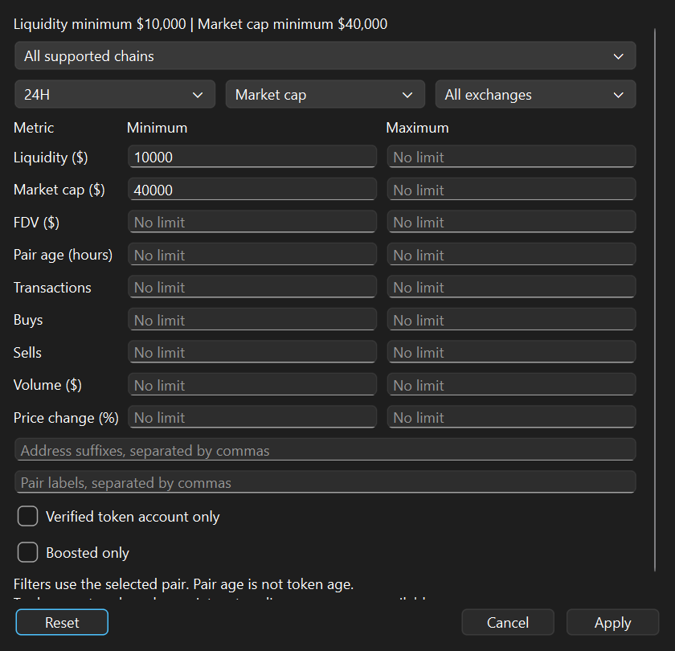

# Gem Search Desktop

Use the sidebar to review tokens, alerts, watchlists, saved records and wallets. Settings contains local connection fields, notification preferences and monitoring duration.

Assistant connection contains a local MCP setup and connection test. See [MCP setup](MCP.md) for supported tools and compatible hosts.

Live tokens default to highest reported market cap first among available records. Unavailable values appear last. Open Filter to select sorting, a minimum market cap or confirmed mints. Search and filters apply before paging. Tables show 50 records per page by default; select 100 per page for a longer list. Previous and Next move between pages. Page-size preferences are saved locally.

Start monitoring manually. Stop it manually or set a time limit. Closing the window keeps monitoring in the system tray. Quit stops the app. Monitoring cannot run while the computer is asleep or powered off.

This Windows x64 preview supports Solana, Ethereum, Base, BNB Chain, Arbitrum, Polygon, Optimism and Avalanche. Some live activity and alert features remain unavailable. Missing values are not estimated. Market values are reported values and are not independently verified USD valuations.

Enter credentials only in the local Settings fields. API access is separate from web account access. Keys and account records stay outside the repository.

Import wallet lists using CSV or JSON with name and address fields. Imports remain local and do not add wallet addresses to the token watchlist.

Download the ZIP from Releases for the executable and bundled licenses. The executable is unsigned. Build using RequirementsDesktop.txt and scripts/BuildDesktop.py.

The current preview uses a public market feed without requiring a key. Quotes are polled every 15 seconds and discovery every minute. Discovery covers profiles, boosted entries, saved tokens and your watchlist, not the entire market. Up to 300 addresses are refreshed per cycle with saved addresses rotated. The highest-liquidity pair supplies each token quote. Reported market capitalization is never replaced with fully diluted valuation.

The live table shows price, market capitalization, five-minute and 24-hour pair volume, five-minute buy and sell counts, liquidity and mint verification. Tokens below $40,000 or with stale or missing market capitalization are excluded. Mint checks verify the account and supply, not the USD price.

The public feed does not provide separate buy and sell USD totals or a one-minute trading window. Net inflow alerts and the early-launch market capitalization alert remain unavailable in this preview. Pair creation time is not treated as token creation time.

Live results and watchlists exclude tokens with liquidity below $10,000, or missing, invalid or stale liquidity. Saved historical records remain accessible. The same liquidity requirement applies to MCP live and watchlist listings.

Filters opens a range editor with minimum and maximum liquidity, market capitalization, FDV, pair age in hours, transaction counts, buys, sells, volume and price change. Activity ranges use the selected 5M, 1H, 6H or 24H window. Exchange, pair labels, address suffixes, boosted status and confirmed mint status can also be selected. Apply saves settings locally and resets live and watchlist pagination. Cancel preserves existing settings. Reset restores the $10,000 liquidity and $40,000 market cap floors with unrestricted optional ranges. Unknown values fail only active optional ranges. Market capitalization and FDV remain separate. Pair age does not establish token creation time.

Proprietary trending scores, trader counts, ads and profile filters are not included because the public quote response does not provide complete data for them. Filters operate on the app's sampled discovery set and selected highest-liquidity pair.

The Chain filter selects one network or all supported networks. Live tables identify each network, and Explorer opens its token explorer. EVM watchlist addresses are normalized while token identity remains network plus address. EVM checks validate RPC chain ID, deployed contract code, totalSupply and decimals at a recorded block. These reads do not establish circulating supply, price accuracy, finality, safety or net inflow. Verification refreshes up to 20 EVM contracts per cycle with networks rotated; unavailable or unrefreshed checks remain pending. Market quotes retain the existing refresh and sampling limits.

The table volume, price change and buy/sell counts now use the timeframe selected in Filters. Headers show that window explicitly. The filter summary shows active bounds and the matching token count before pagination. Applying filters updates both live and watchlist results immediately and retains them through refreshes and reopening.
