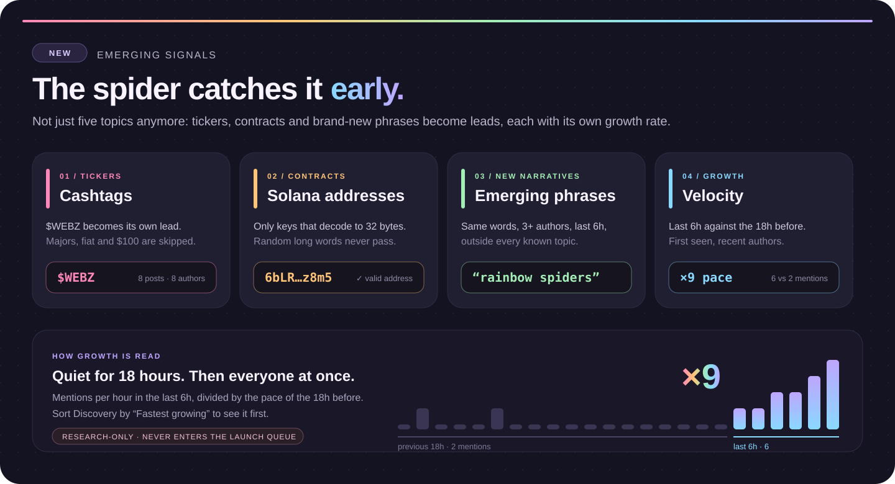
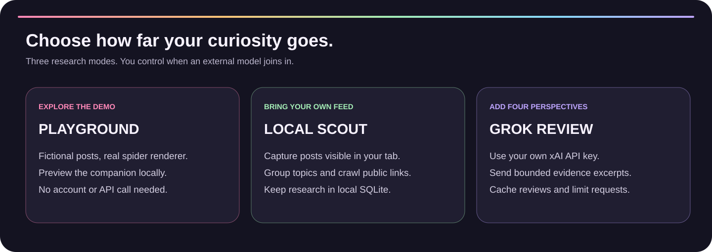
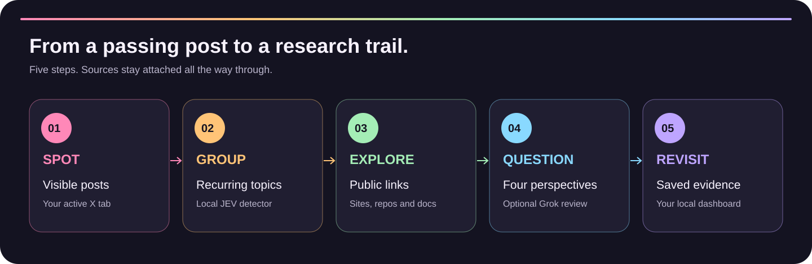
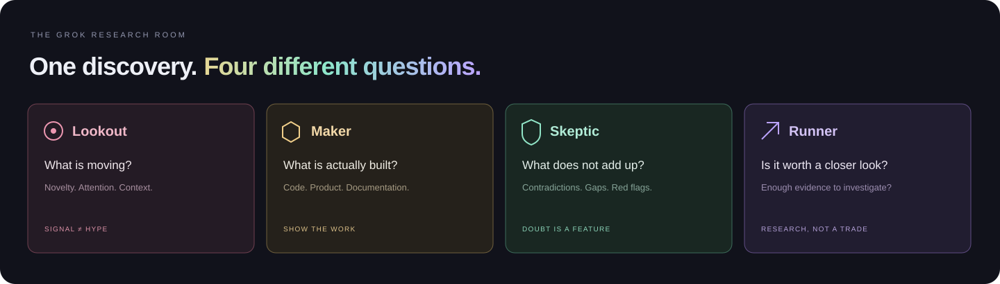

<p align="center"></p>

# Gem Search - паук для поиска нарративов

Паук живёт поверх открытой страницы X, ходит между видимыми постами и подсвечивает то, что сейчас изучает. Локальный **JEV** группирует темы, **crawler** читает ссылки, четыре **Grok-роли** проверяют свидетельства. Дашборд сохраняет источники и причины решений.

JEV - наш модуль, а не подключённый сторонний сервис. Паук работает внутри страницы браузера, не поверх всего рабочего стола. Он не ставит лайки, не пишет сообщения, не подписывается и не подключает кошелёк.

## ✨ Новое: паук замечает раньше

<p align="center"></p>

<!-- 🎬 Запись экрана: перетащи .mp4 в редактор README на GitHub и оставь полученную ссылку отдельной строкой здесь. -->

Нарратив интереснее всего, **пока у него нет имени**. Раньше паук раскладывал всё по пяти темам. Теперь он замечает мелкие конкретные вещи, которые появляются первыми, и показывает, как быстро они растут.

<table>
<tr>
<td width="50%" valign="top"><h3>💲 Тикеры</h3>Каждый <code>$ТИКЕР</code> из постов становится отдельной находкой со своими авторами и постами. <code>$BTC</code>, <code>$SOL</code>, <code>$USDC</code>, другие мейджоры и цены вида <code>$100</code> пропускаются. Один клик открывает живой поиск в X.</td>
<td width="50%" valign="top"><h3>🧾 Контракты</h3>Адреса Solana остаются, только если декодируются в настоящий 32-байтный ключ, поэтому случайные длинные слова не проходят. Один клик открывает адрес в Solscan.</td>
</tr>
<tr>
<td width="50%" valign="top"><h3>🌱 Новые нарративы</h3>Пары слов, которые за последние 6 часов повторили <b>минимум три разных автора</b> и которых нет ни в одной известной теме. Пересекающиеся куски одной фразы считаются один раз.</td>
<td width="50%" valign="top"><h3>📈 Рост</h3>У каждой находки: упоминания за 6 часов против темпа предыдущих 18, авторы за 6 часов и когда паук увидел её впервые. Сутки тишины, потом все разом - это и есть ×9.</td>
</tr>
</table>

**В Discovery:** фильтр по типу сигнала, сортировка **Fastest growing**, **Newest first**, **Most authors** и панель скорости в карточке находки.

### Попробовать за минуту

```sh
python3 app.py                       # терминал 1: локальный движок
python3 scripts/SpiderDemo.py       # терминал 2: примерные посты с живыми логами
```

Скрипт отправляет каждый пост через API расширения и печатает то, что сообщает настоящий движок: захваты, события, каждую находку с ростом и четырьмя проверками. Для тихой загрузки есть `scripts/SampleSignals.py`, для быстрого прогона - `--speed 2`.

1. Открой **http://127.0.0.1:8787** и подожди ~10 секунд.
2. В **Discovery** переключи **All types** на **Tickers $**, потом на **New narratives**.
3. Поставь сортировку **Fastest growing**: `$WEBZ` и «rainbow spiders» поднимутся наверх с ×9.
4. Открой находку: панель скорости, посты и ссылка на Solscan или поиск в X.

Посты, ники, `$WEBZ` и адрес в примере выдуманы и помечены `(sample)`. На настоящей ленте такие же находки появляются из того, что паук видит в твоих вкладках.

### Свои темы

Скопируй `topics.example.json` в `topics.json`, поправь шаблоны (до 40 тем, регулярные выражения без учёта регистра) и перезапусти движок. Сломанный файл игнорируется с предупреждением, встроенные темы продолжают работать. `topics.json` остаётся только у тебя.

### Правила прежние

- **Только исследование.** Тикеры, адреса и фразы не попадают в очередь запуска даже при `SPIDER_ALLOW_LAUNCH=1`: это чужие проекты.
- **Локально.** Всё считается в движке на твоём компьютере. Новых API-запросов и ключей нет.
- **С ограничениями.** За проход - до 10 тикеров, 10 адресов и 5 фраз, сильные первыми, чтобы лимит Grok шёл на лучшие находки.
- **Честно.** Рост - по твоей выборке вкладок, а не по всему X. Три согласованных аккаунта могут накрутить фразу; тикер - повод проверить, а не проверенный токен.

## Что умеет паук

- 🕷️ Перемещается между видимыми постами и подсвечивает текущий.
- 🌈 Показывает счётчик собранных постов; поддерживает паузу и скрытие.
- 🔎 Группирует повторяющиеся темы и ссылки через локальный JEV.
- 📚 Читает публичные страницы, репозитории и документацию через crawler.
- 🧠 Подключает четыре Grok-роли с отдельными вопросами к свидетельствам.
- 🏡 Сохраняет находки, источники и журнал активности на твоём компьютере.
- 📦 Держит до 200 постов в очереди, пока локальный сервер недоступен.
- 💾 Позволяет экспортировать результаты в JSON для дальнейшего изучения.

<p align="center"></p>

## ✦ Капсула находки

Открой проект в **Discovery** → **Discovery capsule** → выбери тему (Aurora или Daylight) → **Download SVG**.

Получишь цветную карточку с радужным пауком, упоминаниями, авторами, локальными проверками, статусом Grok, источниками и временем создания. Есть тёмная и светлая темы. Карточка создаётся в браузере без API-запросов; демоданные помечаются явно. Публикация остаётся за тобой.

## Выбери режим

1. **Посмотреть демо.** Вымышленные посты и настоящий рендерер паука - без аккаунта X и API-вызовов.
2. **Исследовать свою ленту.** Подключи расширение и собирай видимые посты с локальными проверками.
3. **Добавить Grok.** Укажи собственный API-ключ для четырёх отдельных оценок.
4. **Добавить другие источники.** Импортируй JSON или включи сканер Hacker News через `--autopilot`.

<p align="center"></p>

## Запуск

Нужен Python 3.11+, Chrome/Chromium. Сервер: macOS/Linux или Windows через WSL2.

```sh
git clone https://github.com/h100envy/gem-search.git
cd gem-search
cp .env.example .env
python3 app.py
```

1. Открой http://127.0.0.1:8787 → **Connections** → скопируй код подключения.
2. Открой chrome://extensions → **Developer mode** → **Load unpacked** → выбери папку **extension/**.
3. В popup расширения вставь код и нажми **Connect**.
4. Открой ленту/поиск/профиль X и нажми **Release spider on this tab**.
5. Выбери **Until I stop it** (до ручной остановки) или ограничение времени, затем запусти паука. Листай сам или включи опциональную автопрокрутку, в том числе в фоне. Переключение вкладок и приложений не завершает сканирование выбранной ленты. При вводе текста на видимой странице приостанавливается только автопрокрутка. Кнопка **Stop scanner** в окне расширения останавливает выбранную сессию с любой вкладки; кнопка Stop или закрытие панели паука также завершают её.

Сессия и исходный срок сохраняются при приостановке фонового процесса расширения и перезагрузке ленты в пределах того же источника. Закрытие выбранной вкладки, переход на исключённый маршрут или другой источник, а также перезапуск браузера завершают сессию. Выгруженная или замороженная вкладка ждёт восстановления. Спящий компьютер не может собирать новые посты; браузер может замедлять фоновые таймеры. После остановки уже сохранённые в очереди посты могут быть отправлены локальному движку.

Сервер должен оставаться запущенным. Без него расширение сохраняет до 200 постов в локальную очередь.

Демопаук без аккаунта: **http://127.0.0.1:8787/spider-demo**. Все карточки там вымышленные, данные никуда не отправляются.

## От поста до находки

<p align="center"></p>

1. Паук замечает посты в видимой области страницы.
2. JEV убирает дубликаты и группирует поддерживаемые темы и ссылки.
3. Crawler добавляет контекст с публичных страниц.
4. Локальные правила и опциональные Grok-роли проверяют собранные свидетельства.
5. Дашборд сохраняет источники и неизвестные детали для дальнейшего исследования.

*Иллюстрации показывают устройство проекта, а не скриншоты или реальные результаты поиска.*

## Grok-боты

<p align="center"></p>

В `.env`, только локально:

```dotenv
GROK_ENABLED=1
XAI_API_KEY=your_local_api_key
GROK_MODEL=grok-4.7
GROK_DAILY_CALLS=12
```

Перезапусти сервер. Lookout оценивает сигнал, Maker - продукт, Skeptic - противоречия, Runner - достаточность свидетельств. Это четыре отдельных API-запроса с разными промптами. Лимит по умолчанию - максимум три полных оценки за любые 24 часа; ошибки тоже занимают квоту. Повторный анализ одинаковых данных кэшируется. Это лимит запросов, а не гарантия цены в долларах.

Без ключа работают локальные правила. Когда Grok включён, выдержки из собранных постов и страниц передаются xAI. Ключ остаётся на компьютере, а ответы модели не могут выполнять команды или запускать транзакции. В этой версии реальный запрос Grok не проверялся - ключ не предоставлен; тесты API используют заглушки.

## Подключение своей лаунч-платформы

- `LAUNCH_PROVIDER=pumpportal` - встроенный исполнитель Pump.fun.
- `LAUNCH_PROVIDER=bridge` - подключение другой Solana-платформы через HTTPS-адаптер.
- URL, название и API-токен задаются в `.env`; выбранная платформа видна в Launch studio.
- Общая очередь сохраняет лимит пяти попыток за 24 часа и не отправляет повторный запуск при неизвестном результате.
- В репозитории есть шаблон адаптера с HTTPS, SQLite и защитой от повторного создания.

Обычной ссылки на сайт платформы недостаточно: нужен адаптер к её API. Внешний bridge сам подписывает транзакции и обязан соблюдать потолок 0,025 SOL; Gem Search не может гарантировать расходы чужого исполнителя. Другие блокчейны пока не поддерживаются. Шаблон по умолчанию отклоняет запуск без расходов; реальный запуск через стороннюю платформу ещё не проверялся.

[Настройка и протокол подключения](LaunchProviders.md)

## Как начать экономно

- Начни с локальных правил без ключа Grok.
- Используй кэш crawler: страницы сохраняются на 30 минут.
- Повторные оценки одинаковых данных и модели берутся из кэша в течение 24 часов.
- Сохрани лимит 12 API-запросов за любые 24 часа: это до трёх полных оценок, включая неудачные запросы.
- Включай автопрокрутку только когда она нужна.

Лимит запросов ограничивает нагрузку, но не гарантирует фиксированную стоимость услуг xAI.

## Что остаётся честно обозначенным

- Видимые посты - выборка твоей вкладки, не вся лента X.
- Бесплатного полного firehose X здесь нет; для видимых постов API X не требуется.
- DOM X меняется: ручная проверка установки расширения и сбора на актуальном X ещё нужна.
- Локальные темы ограничены понятным набором английских/русских ключевых слов.
- Shortlist означает «изучить дальше», а не «проверенный гем» или обещание прибыли.
- Автолонч токенов сохранён отдельным экспериментальным модулем. Установка расширения не включает его.

[Полная документация](../README.md) · [Приватность](PRIVACY.md) · [Автолонч](AUTOLAUNCH.md)
